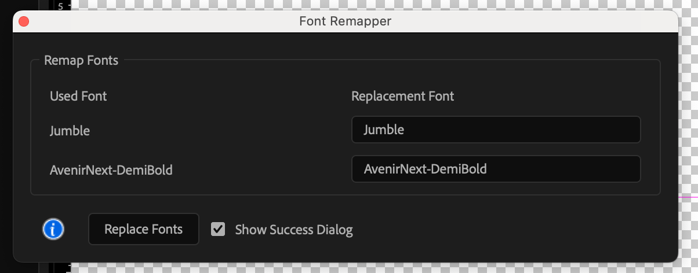

# 🎨 Font Remapper for After Effects

Batch-change font families and weights across your entire Adobe After Effects project with a single, intuitive UI.

---

## ✨ Features

- 🔍 Scans your entire project to detect all used fonts
- 🧰 Displays a visual interface to remap each font to a new one
- 🎯 Applies changes project-wide in one click
- ✅ Option to view a summary of changes
- 🧠 Includes built-in documentation, examples, and FAQs

---

## 📦 Installation

1. Open After Effects.
2. Go to `File > Scripts > Run Script File…`
3. Select the `FontRemapper.jsx` file.
4. Make sure your AE project is open before running the script.

> 💡 *Optional: Place it in the `Scripts` or `Scripts/UI Panels` folder for easy access.*

---

## 🧑‍💻 How It Works

1. The script scans all compositions for text layers and identifies used fonts.
2. It presents a UI where you can assign new fonts to each unique font found.
3. Click **Replace Fonts** to batch-update all applicable text layers.
4. Optionally, see how many layers were successfully updated.

---

## 📋 Example Use Case

Say your entire project uses "Arial-Bold" and "TimesNewRoman-Italic", and you need to change them to "Helvetica-Bold" and "Georgia-Italic". Rather than updating each layer manually, Font Remapper does it in seconds—saving hours of repetitive work.

---

## ❓ FAQ

**Q: Can I skip fonts I don’t want to change?**  
A: Yes! Leave any font field unchanged to preserve it.

**Q: Can I limit changes to specific compositions?**  
A: Not yet. Currently, changes are made project-wide.

**Q: What if the replacement font doesn’t exist?**  
A: The script will attempt to apply it and show an error if it fails.

---

## 🔧 Requirements

- Adobe After Effects (tested on CC 2020+)
- A project must be open with compositions and text layers

---

## 👨‍🎨 Author

**Blake Fealy**  
[Website](https://www.blakefealy.com)

---

## 📄 License

This script is provided as-is, free to use or modify for personal and commercial projects. If you improve it, please consider contributing back or crediting the original author.

---

> © 2025 Blake Fealy — Made with love for motion designers 🖤
